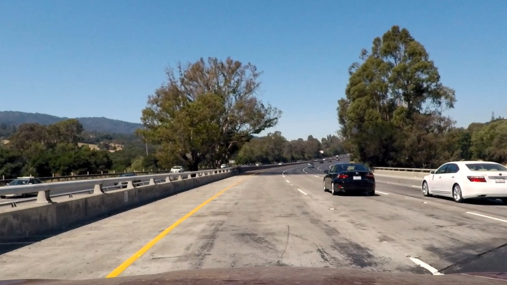
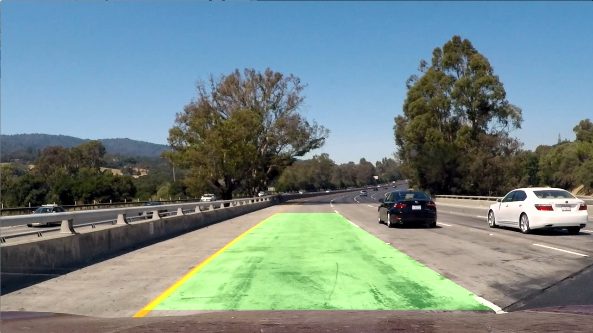

# Advanced Lane Finding

#### This project aims to write a software pipeline to identify the lane boundaries in a video with distortions, curves, shadows, and different road pavements. The following section briefly describes the steps followed to implement the desired software pipeline.

## Solution Approach
I have implemented the desired software pipeline with the help of the following eight steps. 

* First, I have computed the camera calibration matrix and distortion coefficients given a set of chessboard images.
* Next, I have applied a distortion correction to the raw image.
* Then, I have applied a perspective transformation on undistorted image to obtain the <strong>birds-eye view</strong> view of the lanes. Let's call it a warped image.
* Next, I have used color transforms and gradients to create a thresholded binary image of the warped image.
* 
  After that, I have detected lane pixels in the warped image using the sliding window (or search around) method and then obtained the lane lines by fitting second-order polynomials with these pixels. 

* Next, I have calculated the curvature of the lane and position of the vehicle from the lane center.
* Then, I have warped the detected lane lines back onto the original image (i.e., raw image). Let's call it an unwarped image.
* Finally, I have embedded the lane curvature and position of the vehicle on the unwarped image.

It is worthwhile to mention that these steps are applied to each frame of the given video. Now, I will describe the steps mentioned above along with related terms as follows. 

### Camera Calibration Matrix and Distortion Coefficeints

<strong>Image Distortion</strong>: Camera captures the 3D objects and transforms them into 2D images. However, when this transform is not perfect, shapes, sizes, orientations, and positions of some objects are changed. The code of this step is implemented in the `cell 2` of the jupyter notebook. This phenomenon is known as image distortion.

<strong>Camera Calibration</strong>: It is the process of finding the parameters to estimate the position of the camera in 3D environment and position of lens and image sensor. These parameters are used to measure and correct the distortion in the captured images. 

To obtain the camera calibration matrix and distortion coefficeints, I have first extracted corners pixels in a set of chessboard images using `cv2.findChessboardCorners()` function and then passed these cornernrs points to `cv2.calibrateCamera()` function. 

### Distortion Correction
In this step, I have used the camera calibration matrix and distortion coefficients to undistort the images. To correct the distortions, I have used `cv2.undistort()` function.  Below is an example of a distorted and undistorted chessboard image. 
 

<table>
 

  <tr>
    <td>Original Chessboard Image</td>
     <td>Undistorted Chessboard Image</td>
  </tr>
  <tr>
     <td>  </td>
     <td>  </td>
  </tr>
 

 </table>
 
Below is an example of a distorted and undistorted road image.

 <table>
 

  <tr>
    <td>Original Road Image</td>
     <td>Undistorted Road Image</td>
  </tr>
  <tr>
     <td>  </td>
     <td>  </td>
  </tr>
 

 </table>

### Perspective Transformation

<strong>Perespective Transformation</strong> is a computer vision technique that enables us to view an image from different angles and viewpoints. Herein, I have transformed an undistorted road image such that we are viewing the effective lane region as a bird's eye view. To achieve this, I have used `cv2.getPerspectiveTransform()`function. The code of this step is written in the `cell 3` of the jupyter notebook. Below is an example of a bird's eye view conversion of an undistorted image.

 <table>
 

  <tr>
    <td>Undistorted Road Image</td>
     <td>Bird's Eye View of Lane</td>
  </tr>
  <tr>
     <td>  </td>
     <td>  </td>
  </tr>
 

 </table>

### Color and Gradient Thresholing
In this step, I have first obtained the thresholded gradients of the grayscale and S-channel warped images in the <em>x</em> direction. Then, I have determined the thresholded magnitude and direction of the gradient of the S-channel warped Image. Finally, I have combined all the thresholded images such that most of the lane pixels are retained. This step is implemented in the `cell 4` of the jupyter notebook. Below is an example of such threholding. 

 <table>
 

  <tr>
    <td>Bird's Eye View of Lane</td>
     <td>Color and Gradient Thresholded Image</td>
  </tr>
  <tr>
     <td>  </td>
     <td>  </td>
  </tr>
 

 </table>

### Sliding Window Method
Herein, I have first obtained the column-wise histogram of the thresholded image to determine the start points of the left and right lanes. Below is an example of such a histogram. 

 <table>
 

  <tr>
   <td>Color and Gradient Thresholded Image</td>
    <td>Histogram of Thresholded Image</td>
  </tr>
  <tr>
     <td>  </td>
     <td>  </td>
  </tr>
 

 </table>

Next, I have taken the two peaks in the above histogram as the starting pixels of the left and right lane lines. After that, I have applied the sliding window method to obtain the activated pixels (or white pixels) nearby the lane lines and fitted two second-order polynomials (as shown below) to determine the left lane line and right lane line.

 <table>
 

  <tr>
     <td>  </td>
  </tr>
 

 </table>

The code of this method is implmented in the `cell 5` of the jupyter notebook. Below is an example of determing the lane lines using sliding window method and fitting second-order polynomials.

 <table>
 

  <tr>
     <td>Histogram of Thresholded Image</td>
    <td>Pictorial of Sliding Window Method</td>
  </tr>
  <tr>
      <td>  </td>
     <td>  </td>
  </tr>
 

 </table>

### Search Around Method

After obtaining the second-order polynomials in a frame of the video, we can search around these polynomials for determining the lane lines in the subsequent frames, rather than blindly using the sliding window method again. However, I have implemented a sanity check to know if the newly obtained lane lines are a good fit or not. When the obtained lane lines fail the sanity check, I have used the sliding window method for the subsequent video frame. Herein, I have taken the exponentially weighted moving average of the last <em>n</em> good polynomial fits for searching the lane lines in any frame. The code of this method can be found in the `cell 6` of the jupyter notebook.

### Calculating the Curvature of Lane and Position of the Car

The curvature of the lane lines at any point `x` can be obtained using the following formula.

 <table>
 

  <tr>
     <td>  </td>
  </tr>
 

 </table>

Herein, the first and second derivatives of the second-order polynomail are:

 <table>
 

  <tr>
     <td>  </td>
  </tr>
 

 </table>
 <table>
 

  <tr>
     <td>  </td>
  </tr>
 

 </table>

Therefore, the formula to calculate the curvature of lane lines is:

 <table>
 

  <tr>
     <td>  </td>
  </tr>
 

 </table>

The reader can find a detailed tutorial of the same <a href="https://www.intmath.com/applications-differentiation/8-radius-curvature.php" target="_top">here</a>.

 On the other hand, the lane's center is the middle pixel of the image in the <em>x</em> direction, and the vehicle's position is the middle point of the bottom pixels of left and right lines of the lane in the same direction. Thus, the vehicle's position with respect to the lane center is the difference between the said two pixels. This may be noted that I have converted the pixel value into the meter. The correspondig code is implemented in the `cell 7` of the jupyter notebook.

### Reverse Perspective Transformation

In this step, I have first mapped the detected lane lines back onto the original image (i.e., raw image) using `cv2.getPerspectiveTransform()` function and then plotted the lane rigion on the reverse perpective transformed image. This process is implement in the `cell 8` of the jupyter notebook. Below is an example of the reverse perespective transformation. 

 <table>
 

  <tr>
    <td>Pictorial of Sliding Window Method</td>
   <td>Reverse Transformed Image</td>
  </tr>
  <tr>
     <td>  </td>
   <td>  </td>
  </tr>
 

 </table>

### Embedding the Curvature and Postion of the Vehicle on the Reversed Transformed Image

This is the last step of the software pipeline. In this step, I have embedded the lane line's curvature and vehicle's position with respect to the lane center on the reversed transformed image using `cv2.putText()` function. The relevent code can be found in the`cell 9` of the jupyter notebook. Below is an example of the same.

 <table>
 

  <tr>
   <td>Reverse Transformed Image</td>
    <td>Final Annoted Image</td>
  </tr>
  <tr>
   <td>  </td>
   <td>  </td>
  </tr>
 

 </table>

## Software Pipelilne for Video

I have utilized all the steps discussed above in the software pipeline for video. It is implemented in the `cell 13` of the jupyter notebook and processed video can be seen <a href="https://github.com/amarkaswan/CarND-Advanced-Lane-Lines/blob/main/project_video_output.mp4" target="_top">here</a>.

## Discussions

This project uses advanced computer vision technqiues and its software pipeline is more robust than the earlier project. In other words, it can handle videos with image distortion, shades, curves, and different pavements better than the last project.

On the other hand, this pipeline also has many hard-coded parameters that may not adapt well for different videos. Besides, it fails to detect the lanes having vertically mixed pavements, sharper curves, and back-to-back left and right curves (as in hilly areas). In addition, it might also not work for the videos having reflections and different weather conditions, e.g., rain, storm, etc. 
